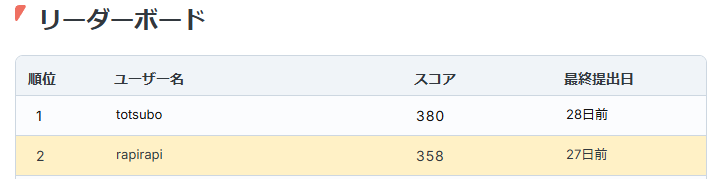

# RAG-Galirage
RAGコンペのリポジトリ

## コードの工夫点まとめ

1. **BM25＋ベクトル検索の二段階スクリーニング**  
   - BM25で質問と文書をスコアリングし、関連度の高い上位文書をまず抽出。  
   - その後、Embedding＋ベクトルストア（Chroma）で精密検索し、**検索効率と回答精度を両立**。

2. **複数チャンクサイズでのドキュメント分割**  
   - `chunk_size` と `chunk_overlap` を動的に設定。  
   - 長めの文脈を保持しつつ細かい粒度で分割し、**高品質な回答**を得るための工夫。

3. **Few-shotプロンプトで回答の一貫性向上**  
   - 医薬品や社内情報などドメイン固有のQ&A例を多数提示し、**回答の精度と一貫性**を強化。  
   - ステップバイステップ思考を誘導して、**より正確かつ簡潔な最終回答**を導出。

4. **PDF読み込みとテキスト正規化の安定化**  
   - 例外をキャッチしてPDF処理の失敗を局所化し、他の処理へ影響を与えない設計。  
   - `normalize_text` で不要な改行や空白を除去し、**検索とトークン化の精度向上**に寄与。

5. **埋め込みストアの再生成とノイズ抑制**  
   - 既存のディレクトリを削除して新規にベクトルストアを生成し、**常に最新データ**で検索可能。  
   - ログレベルやDeprecationWarningの制御で、**運用時のノイズを最小化**。

## リーダーボード順位
2位 / 155人中  

